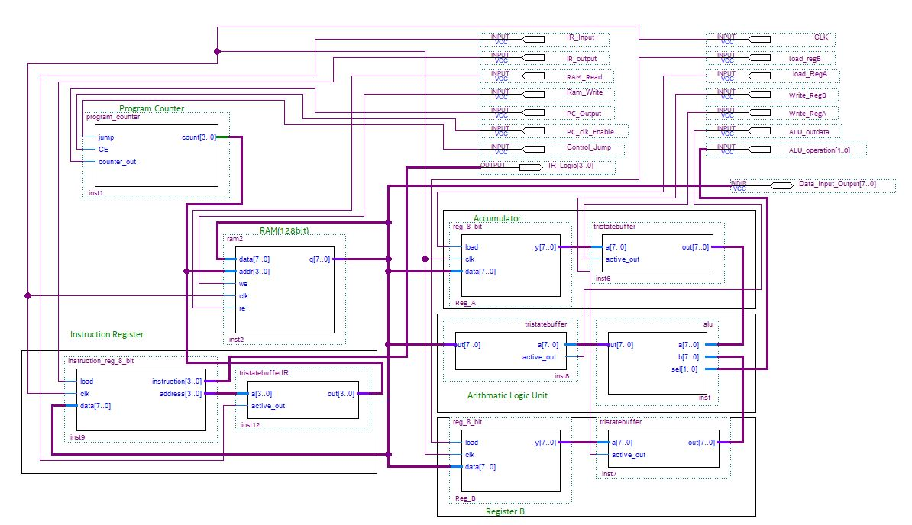
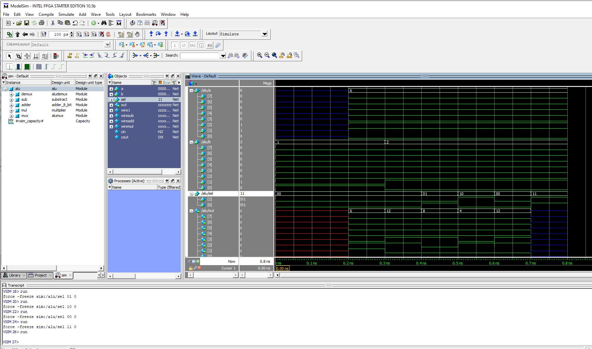
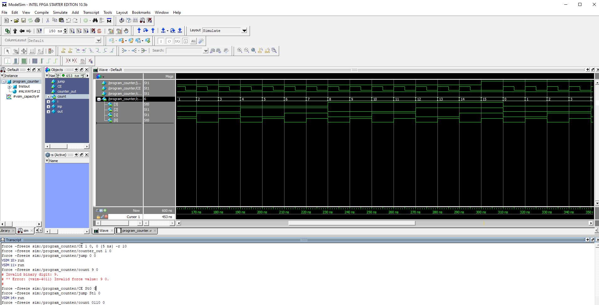
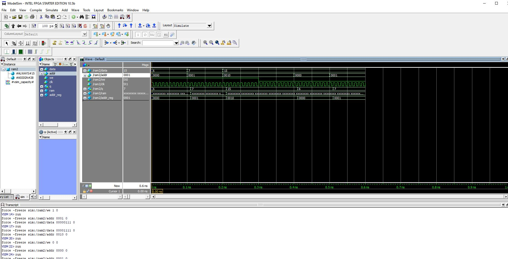

# FPGA-8-Bit-computer

My first FPGA project made from scratch. All the modules in this project are coded in verilog.
Images of the simulation for each module is in the images folder and also shown below.

Refrence

8 bit computer build - Youtube channel  Ben Eater.

Verilog Tutorial- linkedin learning course by Eduardo Corpeno.

Quartus Prime tutorial- Coursera online course by Timothy Scherr(University of Colorado Boulder)

Final Design:-

/////////////////////////////////////////////////////////////////////////////////////////////

ALU Simulation:- 

////////////////////////////////////////////////////////////////////////////////////////////

Program Counter Simulation:-

///////////////////////////////////////////////////////////////////////////////////////////

RAM simulation:-

